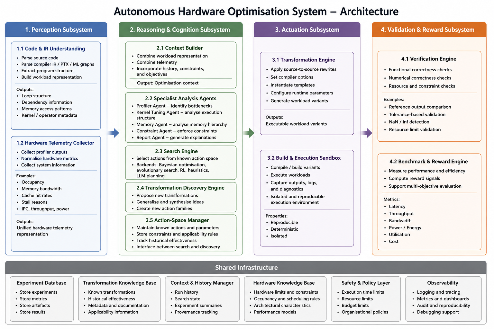

# Autonomous Hardware Optimisation System

An exploration of autonomous optimisation systems for heterogeneous hardware.

The system combines:
- Source and IR analysis
- Hardware telemetry
- Optimisation search
- Transformation discovery
- Deterministic validation

Unlike traditional autotuners, which search within a fixed transformation space, this architecture explicitly separates:
- Search over known optimisation actions
- Discovery of new optimisation actions

allowing the optimisation space itself to evolve over time.

> This repository describes a system architecture and research direction. It is not currently an implementation.

---

## Motivation

Most autotuning systems assume a predefined search space:
- Block size
- Tile size
- Unroll factor
- Vector width

A search algorithm explores combinations of these parameters to find an optimal configuration.

This project extends that idea by introducing transformation discovery.

Instead of only asking:

> Which known optimisation should I try next?

the system can also ask:

> What optimisations are missing from the current search space?

Examples include:
- Shared-memory caching
- Thread coarsening
- Persistent kernels
- Loop fusion
- Kernel fusion
- Alternative memory layouts
- Algorithmic variants

---

## Architecture



---

## Core Idea

The architecture separates three distinct concerns.

### Knowledge

What optimisations are known?

Maintained by:
- Action-Space Manager
- Transformation Knowledge Base

### Search

Which known optimisation should be tried next?

Performed by:
- Search Engine

### Discovery

What new optimisations should exist?

Performed by:
- Transformation Discovery Engine

This separation allows conventional optimisation techniques and LLM-based reasoning to coexist within the same system.

---

## High-Level Workflow

```text
Perceive -> Analyse & Reason -> Decide -> Actuate -> Validate -> Learn & Update -> Repeat
```

---

## Documentation

- [Architecture](docs/architecture.md)

---

## Status

Conceptual architecture / research proposal.

Feedback and discussion are welcome.

## Attribution

The concepts and architecture described in this repository were conceived and developed by the author.

AI-assisted tools were used during design review, discussion, refinement, and documentation.
